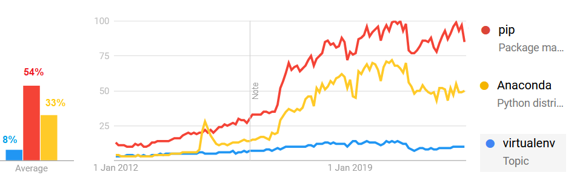

# A guide to managing scientific python computing environments 
By Raphael Luthi (github.com/rluthi)

## Motivation
You have probably **spent way too much time** of your precious life **worrying** about python environments! 

This guide will teach you **a pain-free workflow** using modern and convenient tool to help you finally **tame these bloody python environments**.

## The toolkit
### Overview 
This is a quick overview of the most popular tools to build and manage python environments.

#### pip & vitualenv
- **pip**: the most popular package manager for python
- **PyPI**: a repository of python packages 
- **virtualenv**:  an environment manager for python

#### Anaconda
- **conda**: an open-source package and environment manager that runs on Windows, macOS, and Linux
- **Anaconda repository**: 8000 open-source packages compiled for all major operating systems
- **Anaconda company**: the company that maintains conda and owns the Anaconda repository
- **miniconda**: a minimal installer of conda

- **conda-forge**: a community-led package repository for the conda package manager

#### Mamba
- **mamba**: a more efficient reimplementation of the conda package manager

## Which tool shoud you choose?
### Popularity

Looking at Google Trends data as a proxy for popularity it does not seem that either *pip* or *Anaconda* are overtaking the other. They both seem to have found their niche and be good at what they do. 

This seems to suggest that *pip* and *Anaconda* are not in competition! You should go with the tool that best suits the specificities of your uses case rather religiously choosing one camp.

*The truth comes from the mouth of Google's search history:*



### Strenghts and weaknesses

**pip/virtualenv** is:
- (+) de facto standard for packaging python code
- (+) lightweight

BUT:
- (-) reproducibility can be hard to achieve, especially cross-platform
- (-) no dependency graph optimisation

**conda** is:
- (+) very popular among the scientific computing community
- (+) can optimise complex dependency graphs and make reproducable cross-platform environments 
- (+) handles multiple python versions and non-python binaries(numpy, scipy, ...)

BUT:
- (-) Anaconda (or miniconda) must be pre-installed
- (-) complex dependency graph can be extremely slow to solve

**mamba** is:
- (+) like conda but fast!

BUT:
- (-) not widely adopted

**Good news**: Today pip & conda & mamba work GREAT together!

## The pain-free workflow
### 1. Setting things up

1. If missing, install [Miniconda](https://docs.conda.io/en/latest/miniconda.html)
1. Always make sure conda is up to date: `conda update -n base conda`
1. Speed things up with the experimental [libmamba](https://www.anaconda.com/blog/a-faster-conda-for-a-growing-community) solver:
  -  `conda install -n base conda-libmamba-solver`

### 2. Creating a new conda environment 
**Create** a new conda environment with all the projet's dependencies:

```bash
conda create -n painless_env -c conda-forge --strict-channel-priority -v \
    --experimental-solver libmamba \
    pandas pandera pandas-profiling sweetviz lux-api \
    black flake8 pre-commit nbQA jupyterlab \
    pandas-vet flake8-builtins bandit flake8-markdown \
    pep8-naming flake8-bugbear flake8-variables-names isort
```

**Activate**:
```bash
conda activate painless_env
```

With `--experimental-solver libmamba`, the dependency graph is solved [much faster](https://www.anaconda.com/blog/a-faster-conda-for-a-growing-community)!

### 3. Installing additional libraries
**Additional conda libraries**:   
```bash
conda install -c conda-forge -n painless_env tabulate
```

**Additional pip libraries**:   
```bash
python -m pip install dice
```

**Local package in editable mode:**:   
```bash
python -m pip install -e .
```

### 4. Exporting and reproducing the environment
**Exporting** the current environment configurations : 
```bash
conda env export | grep -v "^prefix: " > environment.yml
```

**Deterministic recreation** of the environment:
```bash
conda env create -f environment.yml
```

**Tips**: 
- The yaml file might become massive, but that's okay!
- The yaml file should be versioned along with the project 

## Change in Anaconda terms of service

**Be aware**: since March 2022, you need an enterprise licence is required for commercial usage of Anaconda's services 

*Non commercial* usage is defined as:
- individual hobbyists
- students
- universities
- non-profit organisations
- businesses with less than 200 employees

More info:
- [Anaconda Commercial Edition FAQ](https://www.anaconda.com/blog/anaconda-commercial-edition-faq)
- [Anaconda pricing](https://www.anaconda.com/pricing)
- [Anaconda terms of service](https://www.anaconda.com/terms-of-service)

## Usefull links
[conda-cheatsheet](https://conda.io/projects/conda/en/latest/user-guide/install/linux.html)
